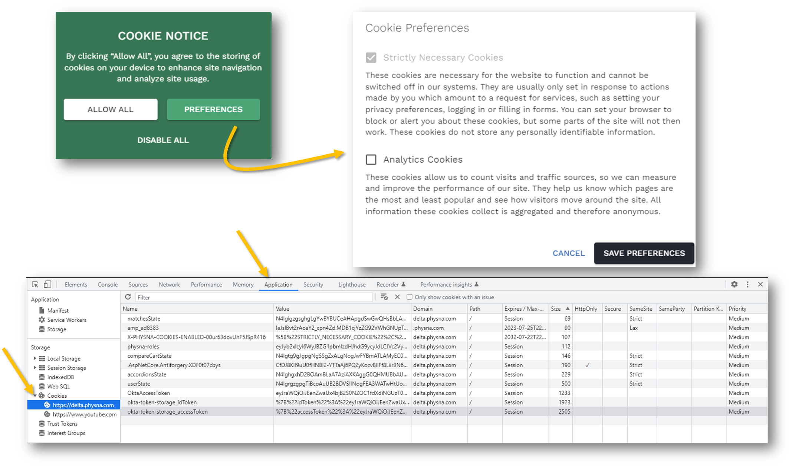
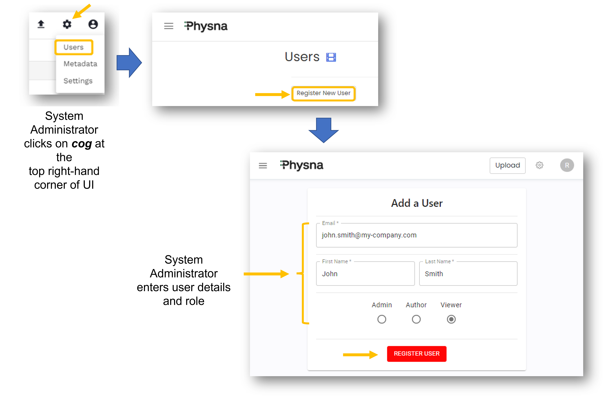
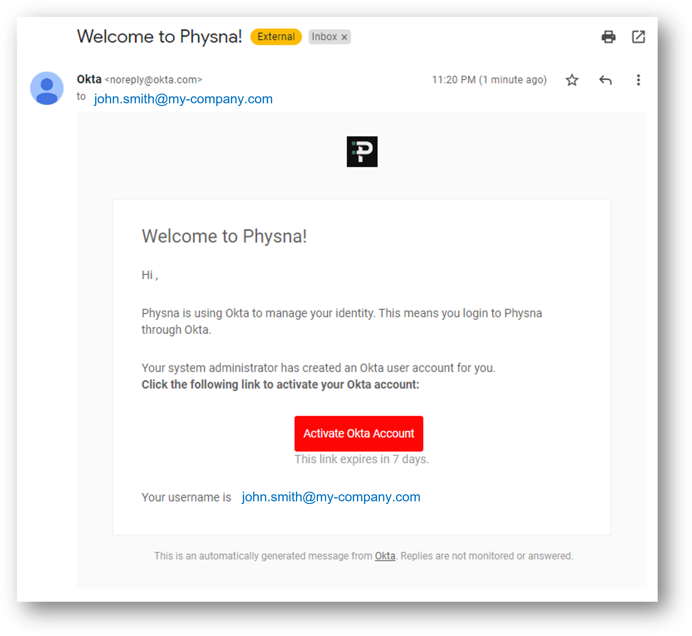

# End User Guide v1.0.0

## Overview
This guide describes the features available to an End User of the Physna Enterprise Platform, a cloud-based 3D Geometric Search and Analysis solution enhanced by AI/ML. The intended audience includes anyone with access to a Physna Enterprise Graphics User Interface environment who needs to:

- upload models (CAD or SCAN files of parts or assemblies)
- organize models in folders and projects
- add or upload metadata associated to models
- search for models using 2D photos or 3D models
- search for models within other models 
- find matching models within a certain threshold of similarity
- find all duplicate models

_Note: depending on your Master Services Agreement and the features your company subscribed to, some of functionality described in this user guide may not be available to you_.

## Table of Contents

1. [What is Physna and what is it not?](#what-is-physna)
2. [How do I access a Physna environment?](#how-do-i-access)
3. [Navigating the Physna User Interface](#navigating-the-ui)
4. [Example use cases](#use-cases)
5. [Help and Support](#help_and_support)
6. [Architecture](#architecture)
7. [Security](#security)
   1) [Security Fundamentals](#fundamentals)
   2) [Compliance and Certifications](#compliance)
   3) [Cookies](#cookies)
   4) [User Management](#user_management)

## 1. What is Physna and what is it not?
- Physna is a company on a journey to empower human creativity by connecting the physical and digital worlds. Physna was founded on the principle that computers should be taught to accurately “think” in 3D – sorting and analyzing geometric objects like written code. Physna is building a future where people have the tools they need to design and analyze the parts and products that shape our world, to create and drive innovation in product design, 3D printing, augmented and virtual reality, gaming, healthcare, and beyond.
- Physna Enterprise is a cloud-based solution that employs patented 3D geometry based algorithms and AI/ML neural networks to search, match and compare 3D models.
- Physna is not a CAD, PDM or PLM tool. 
- Physna does, however, expose its functionality as consumable APIs that can be used to integrate Physna's functionality into existing IT Applications to enhance your company's business processes.
- Physna offers training, consulting and professional services through partner organizations for the customization of the Physna Base Connector that enables one-way or bi-directional movement of model and metadata information between PLM Solutions and Physna.

## 2. How do I access a Physna environment?
- As a customer, your Sales and Customer Success teams will have given you a URL to access your firewalled, dedicated, and encrypted Physna Environment. The URL will probably follow the structure __https://my-company.physna.com__ where "__my-company__" is the name you agreed to use during initial implementation discussions with Physna's Customer Success team. 
- Ask your Business/Program/Project Leader or designated System Administrator what username you should use to log into your Physna environment. It will probably be your business Email Address or Single-Sign-On ID. If MFA (Multi-Factor Authentication) has been implemented, you will be asked to follow your company's standard MFA procedures.
- Use [Google's Chrome Browser](https://support.google.com/chrome/answer/95346) for better results. Other browsers have limitations that impede the use of all features.
- The Login Page is simple and comes with links in case you forget your username or password.

- When you first access a Physna Environment, you will be asked to set preferences and to accept the storing of cookies on your device.
- If your username has yet to be created, please refer to the [User Management](#user_management) section of this User Guide.

## 3. Navigating the Physna User Interface<a name="navigating-the-ui"><a/>
### 3a. Main Landing Page

- The main landing page, as seen below, is packed with features that are one click-away from delivering great insights into your 3D models. Please note that depending on your user role and the set of features your company has subscribed to use, some of the menu items may not be active or available to you.

- Diving deeper into the main landing page features. Using the annotated diagram shown below, follow the sequence of numbers and their descriptions:

1. The search bar is for case-insensitive, partial or complete names of models, filenames, or metadata elements associated with the models. In the example above, the end user searched for "xx" and the results show all the models that contain "xx" in their names.
2. The triple horizontal lines open or close the sub-menu of advanced features and file management options that will be explained in a subsequent section of this user guide.  
3. The question mark icon opens a "Match Type" help screen that explains the 4 modalities of searches available to the end user directly from the main landing page.
    
    (i) Match: finds models that are geometrically similar to a chosen model
   
    (ii) Part Match: finds models into which your chosen model fits
   
    (iii) Scan Match: finds models when the chosen model is a high-poly scan by comparing bounding box volume parameters
   
    (iv) Classification Match: finds models using their geometric classification or predicted geometric classification
4. The radio buttons that switch the results between the 4 main modalities of searches available to the end user. The numbers between brackets indicate the number of hits, within the match tolerance (default value: 80%) specified immediately below. 
5. The match tolerance between 0 and 100% that is used to filter the search result set.
6. The model chosen as the subject for the searches. The model selection is controlled by clicking on the "Find Matches" URL next to any model displayed on the screen.
7. The result set with Match % details, model names and the ability to change the chosen model to be used in a "Find matches" query. In this section you can also click on "Add to Compare Cart" to add any given pair of models for comparison. Comparisons will be explained in a subsequent section of this user guide.  
8. Metadata fields associated horizontally to each other and to model in the same row. The titles of the columns can be dragged and moved, hidden and pinned to the left or the right of the displayed.

9. Comparison Cart showing any two models to be compared. The models listed in the compare section can be cleared out from the cart or each model can be individually removed from the cart using the "x" next to it. Comparisons will be explained in a subsequent section of this user guide.
10. Download the contents of the page into using an Excel-friendly format.
11. Pagination control when the result sets can't be shown on a single page.
12. The three icons, in order from left to right, represent functionality that will be explained in a subsequent section of this user guide.
  
    (i) Upload models
  
    (ii) General settings
   
    (iii) User settings
    
13. The ability to toggle the display of results between the tighter table format shown above and the bigger thumbnails format shown below.

### 3b. Uploading Files

For Physna to be able to index the geometry of your 3D models, you would need to first upload all necessary files to it. The upload button is in the upper-right corner of the page as shown here:

 

Pressing this button will open the upload page:

1. Dropdown that lists all available folders in the environment and allows the user to select the target folder for the upload. The default is "Default Container"
2. Specify the units of measure (e.g., "inch", "mm")
3. When checked, it will prevent the upload of duplicate files
4. Pressing the "Upload Files" button will display standard file selection dialog. Choose one or more files from your local storage to be uploaded
5. List of recently uploaded files. Mostly for your information

Clicking the "Upload Files" button will open standard file selection dialog. The way that appears will depend on your operating system. Once you confirm your file selection the file will be uploaded to Physna and indexing will be initiated. Progress bar in the right side of the page will be displayed.

At this time, the model should be visible in the destination folder. Physna will proceed through several stages of processing. When the processing state reaches "Finished", the model is ready for use. You can always see the status in the folder's page as shown previously.

## 4. Example Use Cases<a name="use-cases"><a/>

In the previous chapters we learned how to upload a file and how to navigate around the Physna's web site. In this chapter we will provide some examples of the types of practical operations one could perform.

### Searching for duplicate/similar parts

Provided that we have uploaded our inventory of parts to Physna as described earlier and all our models are in "Finished" state, we are ready to search for similar parts. 

With large teams and/or number of models, it is often possible to produce duplicate or at least very similar designs. This occurs even in cases where the company utilizes good PLM system and practice. In such cases, we find ourselves in a situation where the same part may be registered with different part numbers and has duplicate 3D models stored.

Physna can find if a model exists based on the geometry even in cases when the metadata differs. There are several types of searches, but the simplest one is the simple "Match".

First, we navigate to the folders where our model of interest is. This could be a model that we uploaded, and we would like to know if there is some other model that matches it with certain percent of confidence.

For this example, we would like to see if "2.3 Shaft\_holder 1\_Trans Connector\_Front Axle\_Unreal Tractor\_by paX" has any models similar to it.

Selecting it from the list of models in the folder will show a context menu with links to "Find Matches" and "Add to Compare Cart". 

__NOTE: You do not need to scroll withing a folder to find your part. You can search for it by name if it is known. Enter the name in the search text field at the top of the main page to quickly navigate to the desired model.__

To find similarities, click on "Find Matches".

You can adjust the match percentage by moving the green slider bar left and right. In this example, with level of 70% we see two candidates. The first one shows match confidence of 86.88%, which indicates high level of similarity. Hovering over it will display the same options. This time, we would like to inspect visually the differences. To do that, we will click on "Add to Compare Cart" for that item.

Notice that in the lower-left corner of the screen the "Compare Cart" now contains one item.

Click "Add to Compare Cart" on the original part to also added it to the cart.

With more than one items in the cart, we now see that the "Compare" button is enabled at the bottom of the panel.

Click that button to open the Comparison Viewer.

The default view is to show both models side by side, but you can also overlay them or use the "X-Ray" model. Those views offer different controls to adjust how they are presented for best effect. For example, you can adjust the opacity of the models.

In many cases, it is sufficient to know the percentage of similarity. If it is 100%, you know that the two parts are exact duplicates even when they are registered with different names in your system. Comparing differences is most useful when you are trying to determine how and why the two are different.

_... to be continued ..._

## 5. Help and Support <a name="help_and_support"><a/>

- You can find the details on how to contact the support team at Physna from the main hamburger menu on the main page. Click on the three horizontal lines icon to open the menu and select "Support" last item in the list. This will open a page explaining how to get in touch.

- Alternatively, you can sent an e-mail to [info@physna.com](mailto:info@physna.com?subject=Physna%20Support) with subject "Support".

- If you have a critical issue that requires immediate attention, please contact your Physna Account Team.

## 6. Architecture <a name="architecture"><a/>    
    
Physna is a cloud-based platform installed as an isolated single tenant in order to guarantee complete control and isolation of your work and valuable data. The architecture diagram shown below represents all the key services used by Physna. 
    

    
Physna is only available on GCP (Google Cloud Platform). Physna's adoption of an API 1st design approach means that the cloud hosting the services is not as important as the public API services. The documentation pertaining to the publicly available API calls can be found at  https://api.physna.com/v2/docs and is in constant evolution.
    
## 7. Security <a name="security"><a/>     
    
### Physna's Security Fundamentals <a name="fundamentals"><a/>  
    
- **Trusted cloud infrastructure**: Physna leverages GCP's secure-by-design infrastructure, built-in protection, and global network to protect your information, identities, applications, and devices. Our stack builds security through progressive layers that deliver true defense in depth at scale.
    
- **Encryption by default, at rest and in transit**: we encrypt data in transit and at rest, ensuring that it can only be accessed by authorized roles and services with audited access to the encryption keys.
    
- **Continuous Availability**: horizontal scalability of microservices allied to an infrastructure designed high standards of performance, resilience, availability, correctness, and security. Physna takes advantage of native, high availability Google features and services to maintain a highly available solution.
    
- **Compliance**: policies and auditable procedures are key to the security of your users and your data.

### Compliance and Certifications <a name="compliance"><a/>

- **Current State**:

    **a) _General Data Protection Regulation (GDPR)_:** Physna is [GDPR](https://gdpr-info.eu/) compliant and can therefore offer solutions to european countries. The key characteristics of being GDPR compliant can be summarized as follows:
   1) Awareness and Communication: ensure Physna employees understand GDPR and communicate with service and staff about why you are collecting the data.
   2) Analysis of Personal Data: analysis of a list of all sensitive data that Physna stores and processes.
   3) Review Procedures: have a suitable privacy policy in place and review it regularly.
   4) Access Rights: list what access rights should be granted and how changes should be handled.
   5) Customer Consent: ensure Physna's customers consent to the processing of their data.
   6) Data Breaches: create and implement a procedure for handling data breaches.
   7) Impact assessment: carry out a data protection impact assessment.
   8) Data Protection Officers (DPO's): have an identified DPO.

    **b) _SOC 2 (System and Organization Controls)_:** Physna is [SOC 2 Type 1](https://www.vanta.com/paid/soc2) compliant and is working through the process to attain SOC 2 Type 2 compliance. SOC 2 is the most sought after security framework for SaaS companies because it demonstrates a company's ability to effectively safeguard the privacy and security of customer and client data. SOC 2 involves:
   1) Continuous Monitoring
   2) Reliable Alerts
   3) Secure Cloud Infrastructure Configuration
   4) Laptop and Desktop Management
   5) Vendor Management
   6) Policy Templates for Business Practices
   7) Security Reports
   9) Auditor Partner Network

    **c) _NIST 800-171_:** Physna is NIST SP800-171 or just 800-171 compliant. NIST 800-171 is a codification of the requirements that any non-Federal computer system must follow in order to store, process, or transmit Controlled Unclassified Information (CUI) or provide security protection for such systems. The exact requirements for NIST SP 800-171 revision 2 can be found at https://nvlpubs.nist.gov/nistpubs/SpecialPublications/NIST.SP.800-171r2.pdf. NIST SP 800-171 compliance is currently required by some Department of Defense contracts via DFARS clause 252.204-7012. The DoD Office of Sponsored Programs verifies and ensures that NIST 800-171 requirements are applicable. The key requirements fall into the following 14 categories.
   1) Access Control    
   2) Awareness and Training    
   3) Audit and Accountability    
   4) Configuration Management   
   5) Identification and Authentication    
   6) Incident Response    
   7) Maintenance    
   8) Media Protection     
   9) Personnel Security    
   10) Physical Protection    
   11) Risk Assessment     
   12) Security Assessment    
   13) System and Communications Protection   
   14) System and Information Integrity

    **d) _Cybersecurity Maturity Model Certification (CMMC)_:** Physna is CMMC Level 2 compliant. The DoD's Cybersecurity Maturity Model Certification (CMMC) program, which is related to NIST SP800-171, but contains 3 different levels, has additional controls, and requires showing a maturity level. Being CMMC compliant requires that companies entrusted with national security information implement cybersecurity standards at progressively advanced levels, depending on the type and sensitivity of the information. The program also sets forward the process for information flow down to subcontractors.    
   1) CMMC level 1: Safeguard federal contract information.
   2) CMMC level 2: Serve as a transition step in cybersecurity maturity progression to protection controlled unclassified information.
   3) CMMC level 3: Protect CUI.
   4) CMMC levels 4-5: Protect CUI and reduce the risk of advanced persistent threats
    
    **e) _NIST 800-53_:** Physna complies with NIST 800-53 which is designed to provide a foundation of guiding elements, strategies, systems, and controls, that can agnostically support any organization’s cybersecurity needs and priorities. By establishing a framework available to all, it fosters communication and allows organizations to speak using a shared language. NIST 800-53 does not specifically support or suggest specific tools, companies, or vendors (intentionally so); it’s designed to be used as new technologies, systems, environments, and organizational changes arise, shifting cybersecurity needs. The NIST 800-53 framework provides a number of different controls and guidance across multiple security and access control families defined under a baseline of impact: low, medium and high. The controls are then designated across 20 security and control families:
   1) AC (Access control): Account management and monitoring, enforcing the policy of least privilege principle, and separation of duties.
   2) AT (Awareness and training): Providing awareness and security training to employees, and elevated technical training for more privileged users.
   3) AU (Audit and accountability): Auditing records and content, retaining records, and providing associated analysis and reporting
   4) CA (Assessment, authorization and monitoring): Penetration testing, and monitoring connections to public networks and external systems 
   5) CM (Configuration management): Implementing configuration change controls, and setting authorized software policies
   6) CP (Contingency planning): Establishing and testing business continuity strategies, as well as alternate processing and storage sides.
   7) IA (Identification and authentication): Managing credentials and setting up authentication policies and systems in place for users, devices, and services.
   8) IP (Individual participation): Obtaining consent and authorizing privacy policies and practices.
   9) IR (Incident response): Setting up incident response training and setting up associated monitoring and reporting systems.
   10) MA (Maintenance): Having an ongoing system, personnel, and tool maintenance.
   11) MP (Media protection): Securing and protecting media access, use, storage, and transportation.
   12) PA (Privacy authorization): Setting policies for collecting, using, and sharing personally identifiable information(PII)
   13) PE (Physical and environmental protection): Ensuring access to emergency power, securing physical access, and protecting against physical risk and damage.
   14) PM (Program management): Having defined strategies for risk management, insider threats, and scaling architecture.
   15) PL (Planning): Having strategies in place for comprehensive security architecture (such as defense in depth and third-party vendor security)
   16) PS (Personnel security): Screening internal and external personnel, setting up termination and transfer security policies.
   17) RA (Risk assessment): Scanning vulnerabilities, having ongoing privacy impact, and risk assessments.
   18) SA (System and services acquisition): Implementing security across the system development lifecycle, new vendor contracts, and acquisitions.
   19) SC (System and communications protection): Partitioning applications, implementing cryptographic key management, and securing passwords and other sensitive data.
   20) SI (System and information integrity): Implementing system monitoring, alerting systems, and flaw remediation processes.

    **f) _FedRAMP (Federal Risk and Authorization Management Program)_:** Physna's certification and compliance roadmap will ultimately get to FedRAMP Levels 1 and 2. In order to attain FedRAMP compliance Physna will be working through the following steps:
    1) Gap analysis to understand how the current “as-is” environment aligns to the FedRAMP security requirements.
    2) Confirm executive leadership buy-in and the support of all stakeholders familiar with SOC, ISO, CMMC, and other standards.
    3) Find an Agency partner that will issue an “Authorization to Operate” (ATO). The ATO is the official management decision given by a senior Federal official to authorize operation of an information system and to explicitly accept the risk to agency operations. The natural Agency partner to work with for a FedRAMP authorization is one that is using your product or is committed to using your product.
    4) Define Physna's boundary: an authorization boundary describes a cloud system’s internal components and connections to external services and systems and accounts for the flow of all federal information and metadata through the system. It illustrates a CSP’s (Cloud Service Provider) scope of control over the system in addition to any system components or services that are leveraged from external services or controlled by the customer. As a core component of any FedRAMP System Security Plan (SSP), it is imperative that CSPs understand how to accurately describe and illustrate their cloud system’s authorization boundary. 
    5) Approach FedRAMP as a continuous program: the initial authorization represents a major milestone, but only represents a system’s risk posture at a single point in time. Security applies throughout the lifecycle of a system; cloud services must be continuously monitored and kept up to date to ensure the appropriate risk posture is maintained.

### Cookies <a name="cookies"><a/>

When 1st accessing Physna, you will be asked to accept cookies per the example shown below:
    

    
    
### User Management <a name="user_management"><a/>
    
**Physna's users can assume one of 4 user roles:**
- **Viewer:** Viewers cannot make any changes to Files, Folders or Projects; they are only able to view Files, run queries, as well as download Files and Metadata.

- **Author:** an Author can upload, edit, and delete Files. They can also add or remove Folders and Project.
    
- **Administrator:** an Administrator can add, remove, and change Users; they can change ownership of Files, Folders, and Projects, change settings, as well as perform any functions that Authors and Viewers are allowed to perform.
    
- **SA (Super Administrator)**: one or two Super Administrators must be identified per Physna environment. The SA is the only role allowed to change certain settings and parameters that affect the overall behavior of the Physna environment. For example: number of processor threads or background execution of batch functions. The role was necessary when Physna offered an on-site installation of its software. The role will soon be deprecated because Physna no longer supports on-site installations of its enterprise solution.

**Initial User Set Up**

A Physna environment is set up by Physna's Engineering team and delivered by Physna's Customer Success Team as part of an implementation engagement. This initial engagement typically includes the creation of one or two System Administrators as well as their basic administration training. The subsequent set up of additional users is performed by one of the System Administrators and completed by the end user himself/herself. The steps are as follows: 
   
   1. The System Administrator adds the new user to Physna as shown below:

   
   
   2. The new user checks for an email from Okta. It expires 7 days after being issued and can only be used once. If one attempts to use the same link for a second time, a "Token Expired" message is displayed. 
   
   
   
   3. The new user follows the Okta workflow to create a password as shown below:
   
   
   
   4. The new user will be re-directed to https://physna.com upon completion of the Okta workflow.
   5. He or she should then type in their https://my-company.physna.com address and log in for the first time.

